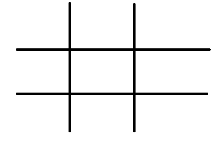
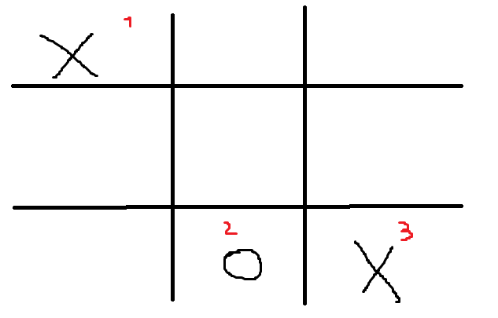
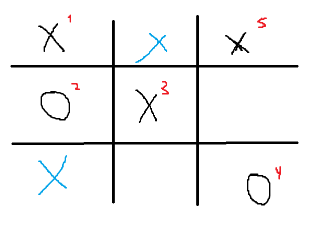

# Minimax In TIC TAC TOE
Rules of the game:
As this is going to be played against the AI, it will be a single player game.
You get to decide whether to go first or second.

The game is played on a grid of your choosing, the game will prompt you for the amount of rows and columns you want to play with.

Note that if you put a value less than 3 for either the column or the row, the game will default it to be 3 instead.

Contrary to the simple tic tac toe, the amount of values you need to connect to win, depends on the amount of rows and columns you choose. Automatically the minmum of these will be chosen.
For example:
    If you choose a 6x8 grid (6 rows and 8 columns), you will need to connect 6 values to win.

This is a practice of basic AI algortihms like minimax.
The goal is to make a basic AI that can play Tic Tac Toe.

And for wich ever point in the game, it will give you a prediction of who is going to be the winner.

## Inner workings:
When starting the game after you enter the size of the grid, then the computer will process all the possible moves for the game.
That way every time you make a move, the computer will already know what the best move is for it to make, and thus make it instantly whithout any delay.

### Minimax:
The way I made the minimax (I don't know if this is the standard way), is that I made it make a tree with all the posibilities of the game, so the minimax in reality is not calculating from his own perspective, but calculating over the entire game, what I mean by that is that it is not that the minimax as he knows it is the `O` player then it will just minimize the value. What it does is that when calculating the tree, each level of the tree corresponds to either a maximizing player or minimizing player (everything good till there), so for each node (A state of the game), the best possible move is saved, so when the game is in that state, and it is the computer turn, it will just make the move that was saved in the tree.

One thing to note, is that in my search of not making every game exactly the same, I made the computer choose randomly between the best moves, that means, that if multiple moves have the same value, the computer will choose randomly between them.

This will make that in reality the computer is not making the exact best move each time, but since the computer is assuming that the human will do the best move, then it will not matter.

Explaning this better:
* Lets say we have an empy 3x3 grid:
    

If both players are playing optimally, it doesn't really matter where the first player puts his value, the second player will always force a tie.

But arguably the best move for the first player is to put his value in one of the cornes, since that will give him the most chances of winning, because unless the second player plays middle, then it is a win for X.
* This can be seen in the following examples:
    
* In this example circle needs to play middle now, or it is a win for X, but after circle moves here, X plays in the top right corner, and that makes it a win for X, since no matter where O plays, X has a winning move.

    
* In this example I made it even more clear, were the blue X mean the winning places for X in the next turn.

All this happens to all cases where after X playing in the corner, O doesn't play in the middle.

But since like I said, playing `optimally` all games will result in a tie, then the computer might as well play randomly in the board, even tho, like I said, the best move is to play in the corners at first.

## About optimization:
This implementation could be optimized in the sense of picking not only a move that will lead us to a win, but also that will have more posibilities to get us to a win, or directly just choosing the shortest path in the tree, etc.

Also the algorithm for computing a solution could be greately optimized if it just picked the first best move, and not all the possible moves, but I wanted to make it so that not all games were equal. (Even tho the result will be).